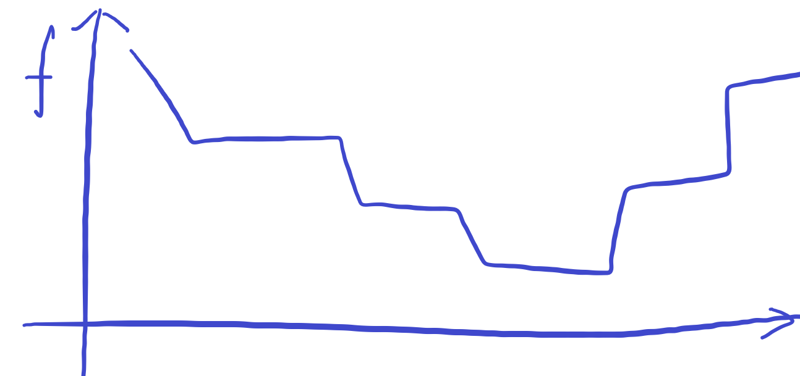

# Problem D 
## Mistake
非严格单峰函数(见下图)无法二分。回想二分性质, 性质1和性质2不能存在交集,然而本思路存在差分为0的共同点。

## Solution 1
符号声明:
| Variable      | Defination                                         |
| ------------- | -------------------------------------------------- |
| $b_1,b_2,b_3$ | Carv选取的三个Pattern,不失一般性，令$b_1<b_2<b_3$. |
| $a_i$         | 第$i$个客人需要的Pattern,不失一般性，假设$a$非严格递增.                                  |
|               |                                                    |

可以推导, 所求为$\min_{b}\max_{i}\min_j|a_i - b_j|$.
观察样例，可以推断出$b_j$的分布情况为下图:

即$l,r$将$a$分割为三个不为空的区间:$[1,l],[l+1,r],[r+1,n]$，$b_1,b_2,b_3$分别坐落于其中。对于每个区间$[x,y]$，最优解为$\lceil (a_y - a_x)/2\rceil$.

最终答案即为$\min_{l,r}\max(\lceil (a_{l} - a_{1})/2\rceil,\lceil (a_{r} - a_{l+1})/2 \rceil,\lceil (a_{n} - a_{r+1})/2\rceil)$.

枚举$l$, 可以推断$\min_{r}\max(\lceil (a_{r} - a_{l+1})/2 \rceil,\lceil (a_{n} - a_{r+1})/2\rceil)$当且仅当区间$[a_r,a_{r+1}]$包含实数$(a_n - a_l)/2$. 此处可以使用二分实现。

## 复杂度
$O(n\log n)$